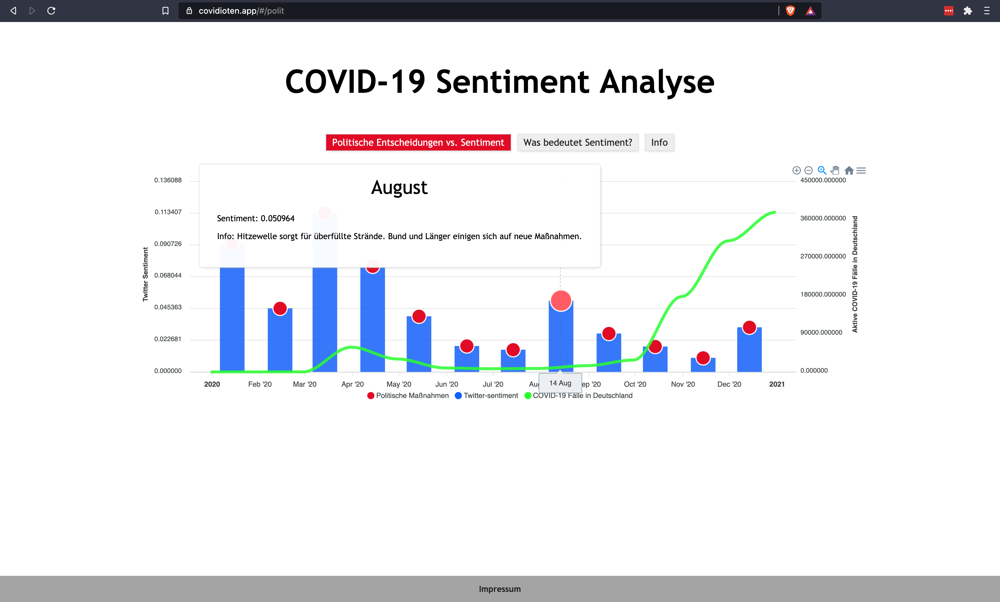
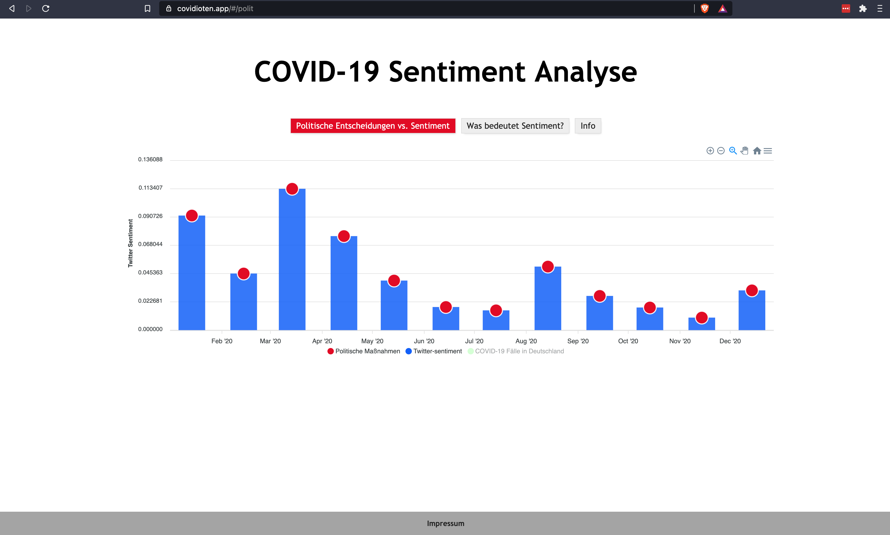

# Introduction and Goals

This project analysis Twitter data concerning the sentiment of tweet in Germany and compares the data to cases of COVID-19 in Germany. Furthermore, this application displays the political and epidemical situation in Germany in 2020. To just use the application visit [covidioten.app](https://covidioten.app/#/polit).
This is only the repository where the Frontend is stored. For the data analysis visit the [Sentiment Analysis repository](https://github.com/Covidioten/BAPraktikumSentimentAnalyse).
The Webserver Backend is stored in [this repository](https://github.com/Covidioten/WebServer).
The app mainly focus on German-speaking users. Thus, the explanations and labels are in German.

# Table of Contents

- [Technologies](#technologies)
- [Execution instructions](#Execution-nstructions)
- [Repo Structure](#Repo-structure)
- [Architecture Contraints](#Architecture-Contraints)
- [System Scope and Context](#System-Scope-and-Context)
- [Solution Strategy](#Solution-Strategy)
- [How to use the app](#how-to-use-the-app)

# Technolgies

## Data and Analytics

- Apache Hadoop
- TextBlob

## Backend

- Flask
- SQLite
- Axios

## Frontend

- [Vue.js](https://vuejs.org/)
- [ApexCharts.js](https://apexcharts.com/)

# Execution Instructions

Run locally:
The easiest way to run the program is to install it via npm. Since npm comes with node.js we recommend to download node.js from [here](https://nodejs.org/en/) and install it on your machine.

```
$ git clone https://github.com/Covidioten/UI.git
$ cd UI
$ npm install
$ npm run serve
```

Production:

```
$ npm run build
```

# Repo Structure

public:

- contains index.html to host the app

src:

- contains all the components and the main.js
- assets: contains images
- charts: contains the charts created via ApexCharts.js
- components: contains all components that are not charts, e.g., the footer

|__public  
|  
|__src
|  |  
|  |__assets 
|  |  
|  |__charts 
|  |  
|  |__components 

# System Scope and Context

## Business Context

Political decisions have an influence on the sentiment of a country
To research the impact of these decisions on the sentiment we analyze the correlation between the calculated sentiment and political statements and actions.

„Sie glauben gar nicht, wenn man jeden Tag direkt neben Angela Merkel am Tisch sitzt, verliert man alle Eigenschaften eines bayerischen Löwen. Man wird wirklich zahm.“ (CSU-Chef Horst Seehofer am 12. Januar nach den Sondierungsgesprächen beim Neujahrsempfang der bayerischen Staatsregierung in der Münchner Residenz.)
Quelle: neuepresse.de

„Deutschland ist nur so erfolgreich, weil es uns Bayern gibt. Das steht fest.“ (Bayerns designierter Ministerpräsident Markus Söder, CSU, am 14. Februar beim politischen Aschermittwoch in Passau.)

"Wir haben Videoaufnahmen darüber, dass es Hetzjagden gab, dass es Zusammenrottungen gab, dass es Hass auf der Straße gab, und das hat mit unserem Rechtsstaat nichts zu tun.“
(Bundeskanzlerin Angela Merkel am 28. August in Berlin zu den Ausschreitungen im sächsischen Chemnitz.)

## Technical Context

The result file contains the polarity für each day.
The daily polarity is calculated by taking the average over each day
The data for these calculations is included in the structure aswell

| Bundesland | Polarity |
| ---------- | -------- |
| 03.03.2021 | 0.4      |
| 04.03.2021 | 0.2      |
| 05.03.2021 | 0.6      |
| 06.03.2021 | 0.1      |
| 07.03.2021 | 0.8      |
| 08.03.2021 | 0.9      |
| 09.03.2021 | 0.2      |
| 10.03.2021 | 0.52     |
| 11.03.2021 | 0.14     |
| 12.03.2021 | 0.16     |
| 13.03.2021 | 0.61     |
| 14.03.2021 | 0.26     |
| 15.03.2021 | 0.67     |
| 16.03.2021 | 0.72     |
| 17.03.2021 | 0.83     |
| 18.03.2021 | 0.25     |
| 19.03.2021 | 0.6      |

```json
{
  "root": [
    {
      "03.03.2021": {
        "sentiment": 0.6,
        "data": {
          "TweetId": {
            "03.03.2021-01:30": 0.4
          },
          "Twe3tId": {
            "03.03.2021-02:30": 0.8
          }
        }
      }
    },
    {
      "04.03.2021": {
        "sentiment": 0.6,
        "data": {
          "TweetId": {
            "04.03.2021-01:30": 0.4
          },
          "Twe3tId": {
            "04.03.2021-02:30": 0.8
          }
        }
      }
    }
  ]
}
```

# Solution Strategy

The GUI needs to fill the users' need to analyze and understand the possible correlation between the sentiment on Twitter and the number of COVID-19 cases in Germany. Therefore, it needs a visualization of the data and an explanation of the data and the term "sentiment".

# How to use the app

Visit [covidioten.app](https://covidioten.app/#/polit) to use the already hosted app.<br />
First, you will see the view of the chart. When you are hovering over the red markers a so-called tooltip opens up which shows information about the sentiment of this month and about political news and measures during this month in Germany.
<br />
<br />



<br />
ApexCharts allows you to switch off different lines by clicking on the label below the chart.
<br />
<br />



<br />
Furthermore, you can use the buttons to switch between views. Check out the sentiment explanation to understand what sentiment is. The info view gives some information about the authors of this repository.
